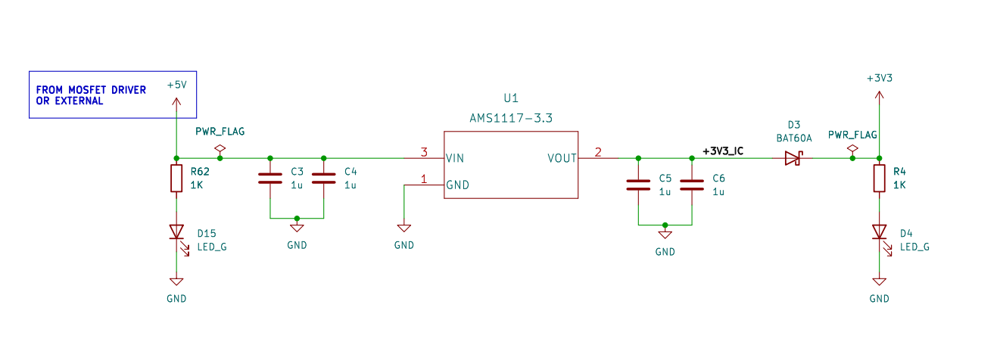
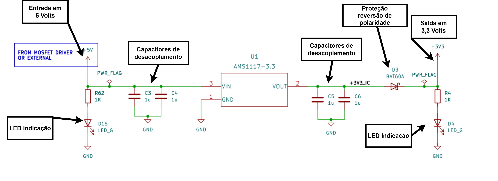
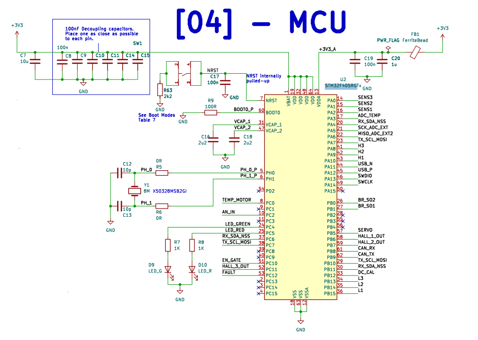
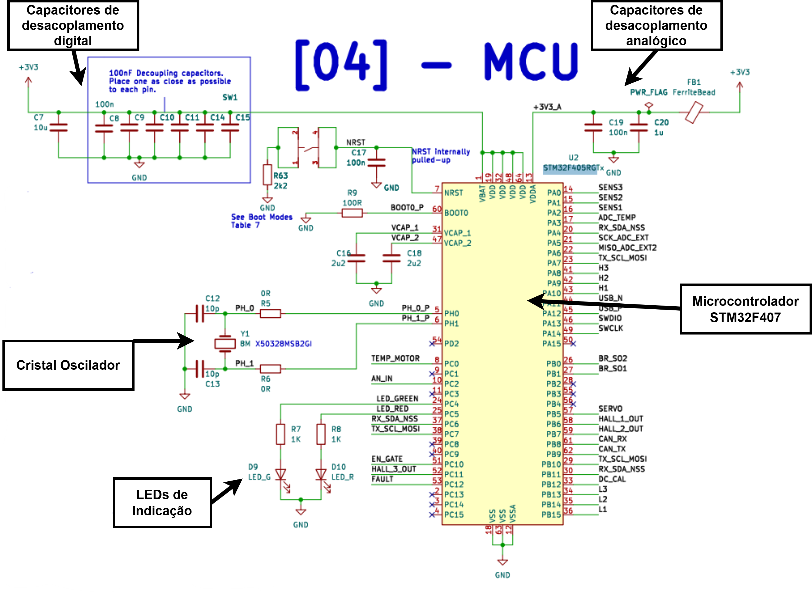
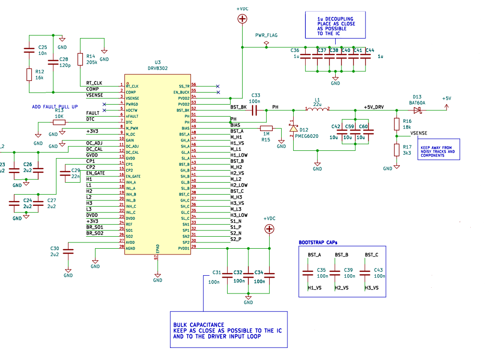
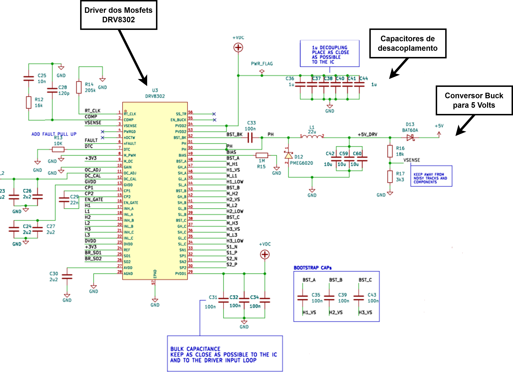
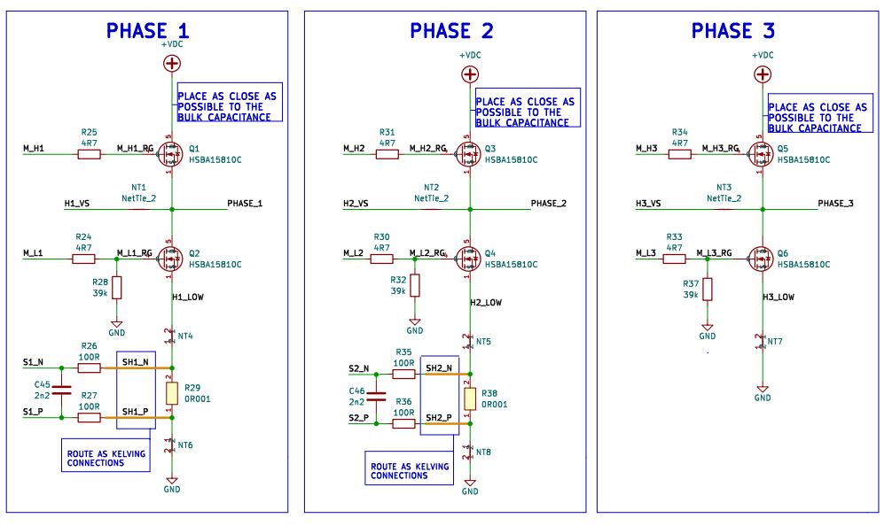
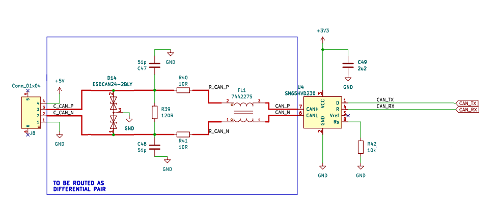
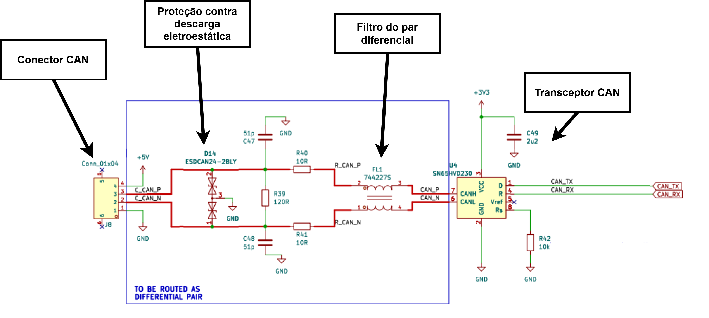

# 2.1. PROJETO DO CIRCUITO REGULADOR DE TENSÃO

### 2.1.1. O que foi feito

Foi realizado o projeto de um circuito regulador de tensão utilizando um regulador de baixa tensão de queda
(Low Dropout), capaz de converter uma tensão de 5 volts para 3,3 volts.

## 2.1.2. Por que foi feito

O projeto foi desenvolvido para alimentar o circuito do microcontrolador, permitindo que o micro operasse na
tensão adequada.

## 2.1.3. Como foi feito

O circuito do regulador de tensão foi desenhado, conforme ilustrado na figura 1.

O design segue o sentido de fluxo da esquerda para a direita, com a entrada de energia de 5 volts posicionada à
esquerda e a saída regulada de 3,3 volts um pouco mais à direita. A figura 2 apresenta uma visão mais detalhada
das partes do circuito.

Conseguimos ver que o circuito conta com duas indicações com led para mostrar que há energia, tanto na entrada
do circuito quanto na saída.

No detalhamento do circuito, é possível observar dois LEDs indicadores, que têm a função de sinalizar a presença
de energia tanto na entrada quanto na saída. Esses LEDs visam a fácil verificação do estado do
circuito, garantindo que o usuário possa rapidamente identificar se o circuito está operando corretamente.

Para mitigar a interferência de ruídos comuns na fonte de alimentação, esta incluído capacitores de desacoplamento. Esses
capacitores estão dispostos de maneira a filtrar ruídos tanto na entrada quanto na saída, assegurando uma operação
mais estável do regulador.

No centro do circuito, encontra-se o circuito integrado, identificado pela designação "U1". Este componente é responsável
pela conversão de tensão, utilizando um método de controle interno que assegura uma queda de tensão no próprio componente,
mantendo a saída estável e livre de flutuações indesejadas.

## 2.1.4. Qual a aprendizagem com a atividade

A realização deste projeto proporcionou aprendizagens significativas. Primeiro, foi possível aprofundar o conhecimento sobre a
importância de um regulador de tensão, especialmente em aplicações que exigem uma tensão específica para o funcionamento adequado
de componentes eletrônicos, como no caso dos microcontroladores.

Além disso, a prática de desenhar circuitos de regulação de tensão e selecionar componentes adequados contribuiu para o desenvolvimento
de habilidades de planejamento e análise de circuitos eletrônicos. A identificação de elementos como capacitores, LEDs e diodos de proteção
destacou a relevância de componentes auxiliares no funcionamento geral do circuito.

# 2.2. PROJETO DO CIRCUITO DO MICROCONTROLADOR

### 2.2.1. O que foi feito

Foi realizado o projeto do circuito do microcontrolador, incluindo circuitos auxiliares essenciais para o seu funcionamento apropriado.

### 2.2.2. Por que foi feito

A construção deste circuito foi motivada pela necessidade de integrar o microcontrolador como o núcleo central da placa. Ele
desempenha a função de executar todas as operações lógicas, processar dados e coordenar ações, além de estabelecer comunicação
com outras placas e controladores externos, o que é fundamental para a operação de sistemas embarcados.

### 2.2.3. Como foi feito

A escolha do microcontrolador STM32F405 foi uma etapa crítica do projeto, dado que ele possui 1 MB de memória não volátil e uma
variedade de pinos de propósito geral que podem ser configurados tanto como entradas quanto saídas de sinais. Isso permite
flexibilidade na interação com outros componentes do sistema. O STM32F405 também se destaca por contar com periféricos avançados,
incluindo funções de leitura analógica e suporte a diversos protocolos de comunicação, como SPI, I2C e UART. Ademais, sua interface
para comunicação CAN é particularmente relevante, pois é o principal protocolo utilizado em sistemas embarcados automotivos,
facilitando a interação na aplicações de destino. A configuração do circuito é apresentada na figura 3.

A figura 4 detalha as principais partes do circuito de forma mais objetiva.

O circuito apresenta o microcontrolador no centro e um cristal indicado com um valor de 8 MHz de oscilação,
com o intuito de usar o PLL interno do microcontrolador para atingir um clock interno de 92 MHz.
Dentro do circuito, o microcontrolador é centralizado e conectado a um cristal oscilador de 8 MHz. Esse cristal tem um papel
na determinação da frequência de operação do microcontrolador, permitindo utilizar o PLL interno para alcançar um clock de
92 MHz. Essa configuração não apenas aumenta a eficiência do processamento, mas também melhora a capacidade de resposta em
aplicações que exigem alta performance.

Além do mais, foram implementados circuitos de desacoplamento tanto para a alimentação analógica quanto digital.
Esses circuitos visam proporcionar uma fonte de alimentação mais estável e livre de ruídos, o que garante o correto funcionamento
do microcontrolador e dos periféricos conectados.

Para facilitar a monitorização e o diagnóstico de funcionamento, o circuito inclui dois LEDs utilizados como indicadores visuais
do estado operacional do microcontrolador. Através dos rótulos nos pinos, é possível visualizar a extensa rede de conexões que o
microcontrolador possui. Embora existam muitas interações a serem descritas, uma explicação detalhada de cada conexão poderia
tornar-se excessivamente prolixa e desnecessária para o entendimento geral do projeto.

### 2.2.4. Qual a aprendizagem da atividade

A realização deste circuito proporcionou uma série de aprendizagens na área. Foi possivel ganhar uma compreensão significativa
sobre a arquitetura e funcionamento do microcontrolador STM32F405, incluindo suas capacidades de processamento e interfaces de
comunicação. Essa experiência prática foi fundamental para consolidar conceitos teóricos de eletrônica e programação de microcontroladores.

Além disso, o projeto ajudou a desenvolver habilidades de integração de circuitos, com a implementação de circuitos de desacoplamento e do cristal.
A importância do design cuidadoso na seleção de componentes,enfatizou como pequenas decisões podem ter impactos significativos na performance geral do sistema.

A experiência com a visualização do estado operacional através dos LEDs indicativos destacou a importância do feedback visual em projetos
eletrônicos, permitindo uma interação mais intuitiva com o sistema. Por fim, a prática de documentar e detalhar o circuito fortaleceu a habilidade
de comunicação técnica, essencial para a colaboração em projetos futuros.

# 2.3. PROJETO DO CIRCUITO DRIVER DE MOSFETS

### 2.3.1. O que foi feito

Foi realizado o projeto do circuito driver de MOSFETs, destinado ao controle das fases do motor sem escovas, além de incorporar um conversor
de tensão capaz de transformar a tensão de entrada em 5 volts.

### 2.3.2. Por que foi feito

Este circuito foi desenvolvido para criar uma solução integrada que controla um motor sem escovas e oferece um conversor chaveado para fornecer
5 volts à placa. Essa tensão é necessária para alimentar o circuito regulador que, por sua vez, ajusta a tensão para 3,3 volts,
garantindo que todos os componentes operem conforme suas especificações.

### 2.3.3. Como foi feito

O circuito foi baseado no driver DRV8302, que se destaca por sua capacidade de controlar motores sem escovas de forma eficiente. Um dos principais
recursos deste driver é a integração de um conversor chaveado, que foi configurado para regular a saída a 5 volts, com uma faixa de tensão de entrada
variando de 10 a 30 volts. Essa funcionalidade é tem a função de garantir que o sistema possa operar de forma confiável em uma ampla gama de
condições de alimentação. A figura 5 ilustra o circuito desenvolvido.

A figura 6 detalha os principais circuitos auxiliares que suportam a operação do driver.

É possível visualizar o conversor buck, que regula a tensão, e outros rótulos que se conectam às fases do motor. Entretanto, de forma parecida ao circuito
do microcontrolador, uma explicação pormenorizada de cada parte do circuito poderia tornar-se excessivamente prolixa e não necessariamente contribuiria
para o entendimento geral do sistema.

Além disso, o circuito incorpora um sistema de desacoplamento, projetado para reduzir ruídos indesejados e garantir uma alimentação mais estável e
limpa para o driver. Vários resistores e capacitores foram adicionados ao projeto para garantir que o driver funcione corretamente sob diferentes condições operacionais.

A figura 7 apresenta os circuitos de MOSFETs responsáveis por chavear as fases do motor sem escovas, demonstrando como a potência é gerenciada dentro do sistema.

O funcionamento do driver é orquestrado por meio do microcontrolador, que implementa a lógica programada. Essa programação controla a sequência de ativação
dos MOSFETs, permitindo o controle do motor.

### 2.2.4. Qual a aprendizagem da atividade

A execução desta parte do projeto proporcionou uma rica bagagem de conhecimentos práticos e teóricos na área de controle de motores e circuitos eletrônicos.
Pode-se compreender a importância do driver DRV8302 e suas funcionalidades, incluindo a integração de um conversor de tensão.

O projeto também destacou o papel crítico do design de circuitos auxiliares, como os de desacoplamento, que são fundamentais para minimizar ruídos e
garantir a estabilidade da operação. Aprender a implementar circuitos com resistores e capacitores para otimizar a performance do driver foi uma
experiência prática valiosa.

A visualização e o entendimento dos circuitos de MOSFETs, que conectam diretamente às fases do motor, ofereceram uma compreensão aprofundada de como
o controle eletrônico se traduz em movimento físico.

# 2.4. PROJETO DO CIRCUITO DA COMUNICAÇÃO CAN

### 2.4.1. O que foi feito

Foi desenvolvido um circuito para comunicação CAN, utilizando um transceptor que converte os sinais de transmissão e recepção em um sinal diferencial,
conforme o protocolo.

### 2.4.2. Por que foi feito

Este circuito foi realizado devido à relevância do protocolo CAN, que é o principal meio de comunicação utilizado em sistemas automotivos.
A capacidade desse protocolo de permitir a comunicação rápida e sem ruídos entre diferentes controleadores é fundamental para o funcionamento
da máquina, onde a troca de informações em tempo real é importante.

### 2.4.3. Como foi feito

Para implementar a comunicação CAN, utilizou-se o circuito integrado SN65HVD230. ste transceptor foi escolhido por sua habilidade de
converter sinais de transmissão e recepção em sinais diferenciais, que são menos suscetíveis a ruídos, aumentando assim a confiabilidade
da comunicação. A figura 8 ilustra o circuito desenvolvido.

A figura 9 apresenta um detalhamento dos componentes e da configuração do circuito.

No circuito, encontra-se um conector projetado para facilitar a conexão com outros dispositivos no sistema. Junto ao conector, foi integrada
uma proteção contra descargas eletroestáticas (ESD). Essa proteção é essencial, especialmente em ambientes automotivos, onde a interação
humana com os conectores pode resultar em descargas que comprometam a integridade dos circuitos.

Além disso, um filtro foi implementado para o par diferencial, com o intuito de minimizar ruídos e garantir uma transmissão limpa e estável dos sinais. 

### 2.4.4. Qual a aprendizagem da atividade

A realização desta parte do projeto proporcionou um aprendizado significativo sobre as tecnologias de comunicação em sistemas embarcados,
mais especificamente na aplicação do protocolo CAN.

Adquiririu-se conhecimento prático sobre a configuração do circuito de comunicação, além de compreender a estrutura e funcionamento do sinal
diferencial, uma técnica fundamental para garantir a integridade dos dados em condições adversas. A implementação da proteção contra descargas
eletrostáticas também enfatizou a necessidade de considerar fatores ambientais ao projetar circuitos eletrônicos.

# 2.5. PROJETO DOS CIRCUITOS DE FILTRO DE LEITURA ANALÓGICA